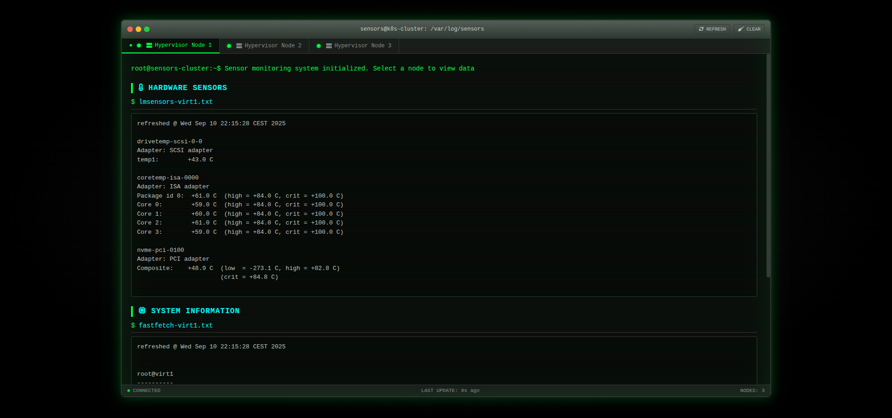

<div align="center">

# 🌡️ LMSensors Kubernetes Monitor

**Real-time hardware monitoring for Kubernetes clusters with dynamic configuration and beautiful web interface**

[](https://github.com/MichaelTrip/lmsensors-container/actions)
[](LICENSE)
[](https://github.com/MichaelTrip/lmsensors-container/releases)
[](https://github.com/MichaelTrip/lmsensors-container/pkgs/container/lmsensors-daemonset-container)



</div>

## ✨ Features

- 🔥 **Real-time Monitoring**: Live hardware sensor data from all cluster nodes
- 🎨 **Modern UI**: Beautiful terminal-style web interface with dark theme
- ⚙️ **Dynamic Configuration**: ConfigMap-based node management with hot-reload
- 🚀 **Cloud Native**: Kubernetes-first design with DaemonSet architecture
- 📱 **Responsive**: Works perfectly on desktop and mobile devices
- 🔄 **Smart Discovery**: Configurable auto-discovery with manual node control
- 📊 **Multi-Node**: Monitor temperature, voltage, and system info across your entire cluster
- 🛠️ **Management Tools**: CLI tools for easy configuration management
- ⚡ **Lightweight**: Optimized containers with minimal resource footprint

## 🏗️ Architecture

This project uses a **dynamic configuration microservice architecture**:

| Component | Purpose | Image | Deployment |
|-----------|---------|-------|------------|
| **Sensor DaemonSet** | Hardware data collection | `ghcr.io/michaeltrip/lmsensors-daemonset-container` | Runs on every node |
| **Web Dashboard** | Modern web interface | `ghcr.io/michaeltrip/lmsensors-web` | Centralized deployment |
| **ConfigMap** | Dynamic node configuration | Built-in Kubernetes | Configuration storage |

### 🔧 Sensor DaemonSet
- **Purpose**: Collects hardware sensor data from each node
- **Technology**: Ubuntu + lm_sensors + fastfetch
- **Deployment**: Runs on every node via DaemonSet
- **Data**: Temperature, voltage, fan speeds, system information
- **Schedule**: Updates every 60 seconds
- **Output**: Standardized file format (`lmsensors-{node}.txt`, `fastfetch-{node}.txt`)

### 🌐 Web Dashboard
- **Purpose**: Modern web interface with dynamic configuration
- **Technology**: nginx + responsive HTML/CSS/JS + ConfigMap integration
- **Features**: Real-time updates, configurable nodes, mobile-friendly
- **Configuration**: Loads node definitions from ConfigMap endpoint
- **Access**: Single deployment with service endpoint

### ⚙️ Dynamic Configuration
- **Purpose**: Centralized node management without code changes
- **Technology**: Kubernetes ConfigMap + custom nginx endpoints
- **Features**: Hot-reload, CLI management, backup/restore
- **Control**: Define which nodes to display with metadata

## 🚀 Quick Start

Get up and running in under 2 minutes with dynamic configuration:

```bash
# Clone the repository
git clone https://github.com/MichaelTrip/lmsensors-container.git
cd lmsensors-container

# Deploy with dynamic configuration
./deploy-dynamic.sh

# Access the dashboard
kubectl port-forward service/sensordash-service 8080:80 -n sensordash
```

Then open [http://localhost:8080](http://localhost:8080) in your browser! 🎉

## ⚙️ Configuration Management

### 🎛️ Node Configuration

Define your nodes in the ConfigMap with rich metadata:

```json
{
  "nodes": [
    {
      "name": "virt1",
      "displayName": "Virtual Node 1",
      "description": "Primary virtual machine",
      "status": "online"
    },
    {
      "name": "worker-01",
      "displayName": "Production Worker 01",
      "description": "Main production workload node",
      "status": "online"
    }
  ],
  "settings": {
    "refreshInterval": 30000,
    "fallbackNodes": ["node-001", "node-002"],
    "autoDiscovery": true,
    "displayMode": "terminal"
  }
}
```

### 🛠️ Management Tools

#### Interactive Configuration Manager
```bash
# View current configuration
./config-manager.sh view

# Add a new node
./config-manager.sh add worker-02 "Production Worker 02"

# Remove a node
./config-manager.sh remove old-node

# Edit configuration interactively
./config-manager.sh edit

# Backup configuration
./config-manager.sh backup

# Show example configuration
./config-manager.sh example
```

#### Direct kubectl Management
```bash
# View current node configuration
kubectl get configmap sensordash-config -n sensordash -o jsonpath='{.data.nodes\.json}' | jq .

# Edit configuration directly
kubectl edit configmap sensordash-config -n sensordash

# Apply new configuration
kubectl apply -f deployment-files/configmap.yaml -n sensordash
```

### 🔧 Configuration Options

| Setting | Description | Default | Example |
|---------|-------------|---------|---------|
| `refreshInterval` | Update frequency (ms) | `30000` | `60000` |
| `fallbackNodes` | Placeholder nodes when no data | `[]` | `["node-001", "node-002"]` |
| `autoDiscovery` | Auto-add discovered nodes | `true` | `false` |
| `displayMode` | UI theme | `"terminal"` | `"terminal"` |

### 🏷️ Node Properties

| Property | Required | Description | Example |
|----------|----------|-------------|---------|
| `name` | ✅ | Node identifier (matches sensor files) | `"worker-01"` |
| `displayName` | ❌ | Human-readable name | `"Production Worker 01"` |
| `description` | ❌ | Node description (shown in tooltips) | `"Main production node"` |
| `status` | ❌ | Default status indicator | `"online"` |

## 📦 Container Images

| Container | Registry | Latest Version |
|-----------|----------|----------------|
| **DaemonSet** | `ghcr.io/michaeltrip/lmsensors-daemonset-container:latest` |  |
| **Web UI** | `ghcr.io/michaeltrip/lmsensors-web:latest` |  |

## 🔧 Requirements

- Kubernetes cluster (1.19+)
- Persistent volume support (`ReadWriteMany`)
- Privileged container support (for hardware access)
- `jq` command-line tool (for config-manager.sh)

## 📋 What You'll Monitor

- 🌡️ **CPU Temperature** - Real-time thermal monitoring
- ⚡ **Voltage Rails** - Power supply monitoring
- 🌀 **Fan Speeds** - Cooling system status
- 💾 **System Info** - Hardware specifications
- 📊 **Node Status** - Health indicators with custom metadata
- 🔄 **Live Updates** - Configurable auto-refresh intervals
- 🏷️ **Custom Labels** - User-defined display names and descriptions

## 🛠️ Deployment Options

### 🚀 Dynamic Configuration (Recommended)
```bash
# Deploy with ConfigMap-based dynamic configuration
./deploy-dynamic.sh

# Manage nodes with CLI tool
./config-manager.sh view
./config-manager.sh add worker-03 "Worker Node 03"
```

### 📁 Project Structure
```
├── sensor-container/         # DaemonSet container source
├── web-container/           # Web interface container source
├── deployment-files/        # Kubernetes manifests
│   ├── configmap.yaml      # Dynamic node configuration
│   ├── webserver-modern.yaml # Web deployment with ConfigMap
│   ├── daemonset.yaml      # Sensor collection DaemonSet
│   └── pvc.yaml           # Persistent volume claim
├── deploy-dynamic.sh        # Quick deployment with ConfigMap
├── config-manager.sh        # Configuration management CLI
├── .github/workflows/       # CI/CD pipelines
└── cleanup.sh              # Cleanup script
```

## 🛠️ Manual Deployment

<details>
<summary>Click to expand manual deployment steps</summary>

```bash
# 1. Create namespace
kubectl create namespace sensordash

# 2. Deploy dynamic configuration
kubectl apply -f deployment-files/configmap.yaml -n sensordash

# 3. Deploy persistent volume claim
kubectl apply -f deployment-files/pvc.yaml -n sensordash

# 4. Deploy sensor collection DaemonSet
kubectl apply -f deployment-files/daemonset.yaml -n sensordash

# 5. Deploy web dashboard with ConfigMap integration
kubectl apply -f deployment-files/webserver-modern.yaml -n sensordash

# 6. Access the dashboard
kubectl port-forward service/sensordash-service 8080:80 -n sensordash
```

</details>

## 🎯 Configuration Examples

### Basic Node Setup
```json
{
  "nodes": [
    {
      "name": "control-plane",
      "displayName": "Control Plane",
      "description": "Kubernetes master node",
      "status": "online"
    },
    {
      "name": "worker-01",
      "displayName": "Worker Node 01",
      "description": "Production workload node",
      "status": "online"
    }
  ]
}
```

### Advanced Configuration
```json
{
  "nodes": [
    {
      "name": "gpu-node-01",
      "displayName": "🎮 GPU Worker 01",
      "description": "NVIDIA RTX 4090 - ML Training Node",
      "status": "online"
    },
    {
      "name": "storage-node",
      "displayName": "💾 Storage Node",
      "description": "High-capacity storage with NVMe arrays",
      "status": "warning"
    }
  ],
  "settings": {
    "refreshInterval": 15000,
    "fallbackNodes": ["placeholder-01", "placeholder-02"],
    "autoDiscovery": false,
    "displayMode": "terminal"
  }
}
```
kubectl apply -f deployment-files/webserver-modern.yaml

# 4. Access the dashboard
kubectl port-forward service/sensordash-service 8080:80
```

</details>

## 🧹 Cleanup

Remove all components safely:

```bash
./cleanup.sh

# Or manual cleanup
kubectl delete namespace sensordash --cascade=foreground
```

The cleanup script will:
- Remove all deployments and services
- Delete the sensordash namespace
- Optionally preserve your sensor data
- Confirm before destructive operations

## 🔄 Configuration Updates

### Hot Reload Configuration
Changes to the ConfigMap are automatically picked up by the web interface:

```bash
# Method 1: Use the management tool
./config-manager.sh add new-node "New Node Display Name"

# Method 2: Edit directly
kubectl edit configmap sensordash-config -n sensordash

# Method 3: Apply updated file
kubectl apply -f deployment-files/configmap.yaml -n sensordash
```

### Backup and Restore
```bash
# Backup current configuration
./config-manager.sh backup
# Creates: sensordash-config-backup-YYYYMMDD-HHMMSS.json

# Restore from backup
./config-manager.sh restore sensordash-config-backup-20250910-143022.json
```

## 🚀 CI/CD Pipeline

This project uses **semantic versioning** with **conventional commits**:

- 🎯 **Automatic versioning** based on commit messages
- 🏗️ **Parallel container builds** for optimal speed
- 📦 **Multi-platform support** (linux/amd64)
- 🔄 **Auto-deployment** file updates
- 🏷️ **Smart tagging** with semantic versions

### Commit Convention

```
feat: add new sensor support     # → Minor version bump
fix: resolve memory leak         # → Patch version bump
feat!: breaking API change       # → Major version bump
```

## 👨‍💻 Development

### Local Development

```bash
# Build containers locally
docker build -t lmsensors-daemonset:dev sensor-container/
docker build -t lmsensors-web:dev web-container/

# Test with docker-compose (if available)
docker-compose up

# Test configuration changes
kubectl apply -f deployment-files/configmap.yaml -n sensordash
./config-manager.sh view
```

### Contributing

1. 🍴 Fork the repository
2. 🌿 Create a feature branch
3. 📝 Use conventional commits
4. 🧪 Test your changes
5. � Test ConfigMap functionality
6. �📤 Submit a pull request

### Testing Configuration Changes

```bash
# Test configuration manager
./config-manager.sh example
./config-manager.sh add test-node "Test Node"
./config-manager.sh view
./config-manager.sh remove test-node

# Test web interface updates
kubectl port-forward service/sensordash-service 8080:80 -n sensordash
# Visit http://localhost:8080 and verify changes
```

## 📖 Advanced Usage

### Custom nginx Configuration
The ConfigMap includes nginx configuration for serving the node configuration:

```nginx
# Custom endpoint in ConfigMap
location /config/nodes.json {
    alias /etc/sensordash/nodes.json;
    add_header Content-Type application/json;
    add_header Cache-Control "no-cache, no-store, must-revalidate";
}
```

### Integration with Monitoring Tools
Export configuration for external tools:

```bash
# Get configuration in various formats
kubectl get configmap sensordash-config -n sensordash -o jsonpath='{.data.nodes\.json}' | jq .

# Export for Prometheus labels
kubectl get configmap sensordash-config -n sensordash -o jsonpath='{.data.nodes\.json}' | jq -r '.nodes[] | "\(.name)=\(.displayName)"'
```

### Multi-Environment Setup
Use different ConfigMaps per environment:

```bash
# Development
kubectl apply -f configmaps/dev-config.yaml -n sensordash-dev

# Production
kubectl apply -f configmaps/prod-config.yaml -n sensordash-prod
```

## 📸 Screenshots

<div align="center">

### 🖥️ Desktop View


*Modern terminal-style interface with real-time sensor data*

</div>

## 🤝 Support

- 📖 **Documentation**: Check our [Wiki](https://github.com/MichaelTrip/lmsensors-container/wiki)
- 🐛 **Issues**: [Report bugs](https://github.com/MichaelTrip/lmsensors-container/issues)
- 💡 **Features**: [Request features](https://github.com/MichaelTrip/lmsensors-container/issues/new?template=feature_request.md)
- 💬 **Discussions**: [Community discussions](https://github.com/MichaelTrip/lmsensors-container/discussions)

## 📄 License

This project is licensed under the **MIT License** - see the [LICENSE](LICENSE) file for details.

## ⭐ Show Your Support

If this project helped you, please consider:
- ⭐ **Starring** the repository
- 🍴 **Forking** for your own use
- 📢 **Sharing** with others
- 🐛 **Contributing** improvements

---

<div align="center">
<strong>Built with ❤️ for the Kubernetes community</strong>
</div>

## Caution
Running containers with `privileged` access can pose security risks. Be cautious where and how you use such configurations.


